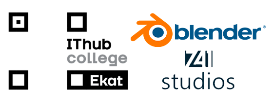

# Blender IThub Ekat Course

---
### Быстрый курс (Основы Blender) созданный специально для студентов колледжа IThub Ekat
---
### Roadmap:
> [**Пара I:**](https://github.com/BogdanDirtyDwarf/blender-ithub-fast-course/tree/main/class-1)
>> *История 3D;*
>>
>> [*Blender Hotkeys;*](https://github.com/BogdanDirtyDwarf/blender-ithub-fast-course/tree/main/class-1#hotkeys--%D0%B3%D0%BE%D1%80%D1%8F%D1%87%D0%B8%D0%B5-%D0%BA%D0%BB%D0%B0%D0%B2%D0%B8%D1%88%D0%B8)
>>
>> *Создание простых объектов;*
>>
>> *Создание композиции;*
>
> [**Пара II:**](https://github.com/BogdanDirtyDwarf/blender-ithub-fast-course/tree/main/class-2)
>> *Базовое текстурирование;*
>>
>> *Модификаторы;*
>
> [**Пара III-IV:**](https://github.com/BogdanDirtyDwarf/blender-ithub-fast-course/tree/main/class-3-4)
>> *Создание модели с костями;*
>>
>> *Создание анимации;*
>>
>> *Камера;*
>>
>> *Рендеринг сцены;*
