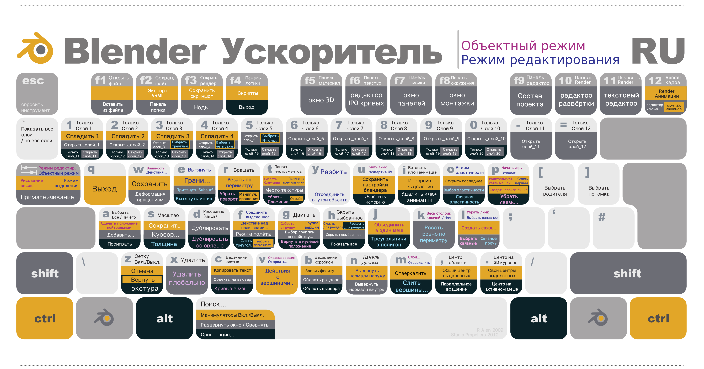

# Blender IThub Ekat Course
### Материал I пары
---
### Hotkeys / Горячие клавиши:
> **Работа с видом:**
>> *Вид с камеры:* **0**
>>
>> *Вид сбоку:* **3/ctrl-3**
>>
>> *Вид сверху/снизу:* **7/ctrl-7**
>>
>> *Вид спереди/сзади:* **1/ctrl-1**
>>
>> *Выбор вида с помощью кольца:* **ё**
>>
>> *Осмотр объектов:* **зажать колёсико мыши**
>>
>> *Перемещение вида в любое удобное положение:* **shift+колёсико мыши**
>>
>> *Показать все объекты:* **home**
>>
>> *Полноэкранный режим (с панелями инструментов) вкл/выкл:* **ctrl-space**
>>
>> *Полноэкранный режим вкл/выкл:* **ctrl-alt-space**
>
> **Смена режима:**
>> *Просмотр объекта/редактирование объекта:* **tab**
>>
>> *Рентген вкл/выкл:* **alt-Z**
>
> **Взаимодействие и редактирование объекта:**
>> *Вращение:* **R**
>>
>> *Выделение объекта:* **A**
>>
>> *Снять выделение:* **alt-A**
>>
>> *Инвертировать выделение:* **ctrl-A**
>>
>> *Масштабирование:* **S**
>>
>> *Выдавить:* **E**, *отмена действия:* **ctrl-z**
>>
>> *Перемещение:* **G**
>>
>> *Скрыть объект или точку:* **H**
>>
>> *Показать всё скрытое:* **alt-H**
>>
>> *Объединить точки:* **M**
>>
>> *Добавить точки внутрь квадрата и тд:* **I**
>>
>> *Нож:* **K**
>>
>> *Открыть меню вершины:* **ctrl-V**
>>
>> *Открыть меню ребра:* **ctrl-E**
>>
>> *Открыть меню грани:* **ctrl-F**
>>
>> *Удаление:* **X**
>>
>> *Пересчитать нормали:* **shift-N**
>>
>> *Создать связи:* **F**
>>
>> *Скос:* **ctrl-B**
>>
>> *Объеденить объекты:* **ctrl-J**
>>
>> *Создание объекта:* **shift-A**
>>

---
### Задание на пару
> Задание 1
>> [У вас сломались объекты, надо их починить](./brokenObjects.blend)
>>
> Задание 2
>> Создайте стол для этих объектов
>>
> Задание 3
>> Разместите их на столе
>>
> Задание 4
>> Сделайте шкаф и заполните его книгами
>>
> Задание 5
>> Сделайте кубик Рубика (без текстур)
>>
---

### Материалы для чтения:
>[Основыне термины 3D](https://www.ixbt.com/video2/terms2k5.shtml)
>
>[Ещё терминология 3D](http://www.malbred.com/3d-grafika-3d-redaktory/sovremennaya-terminologiya-3d-grafiki.html)

